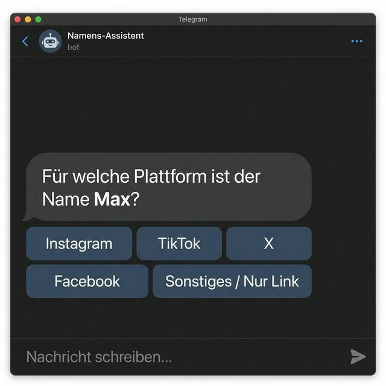
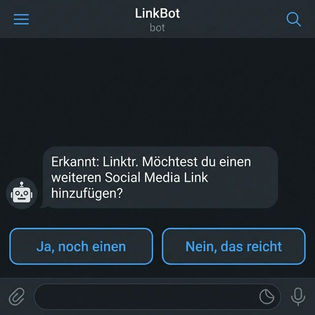
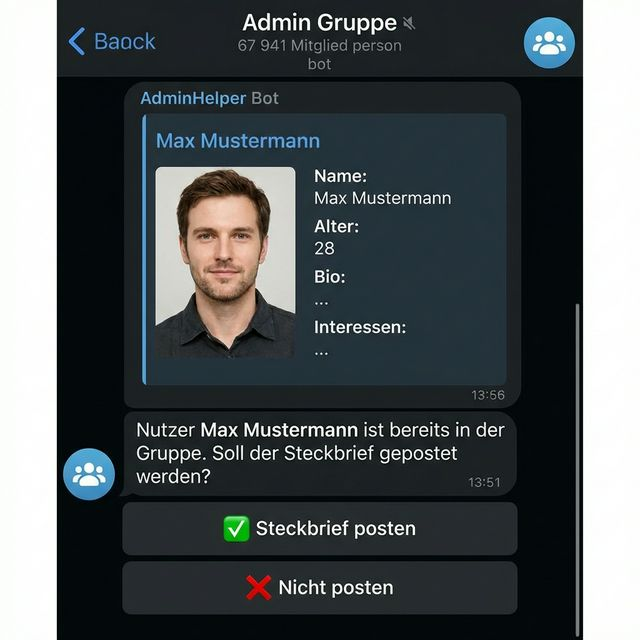

# 🤖 Bot Engine V2 - Engelbert Strauss Gruppe

Ein leistungsstarker Telegram-Bot mit Dashboard zur Verwaltung von Einladungen, ID-Suche, Quiz und Umfragen. Optimiert für Windows und Linux (Docker).

## 🚀 Neue Features & Verbesserungen

### 📱 Intelligente Social Media Erfassung
Der Bot erkennt nun automatisch Plattformen aus URLs. Bei reinen Nutzernamen erscheint ein interaktives Auswahlmenü.
- **Multi-Link Support:** Nutzer können mehrere Accounts hinterlegen.
- **Interaktive Buttons:** Entscheidung über weitere Links erfolgt via Klick-Buttons statt Texteingabe.




### 👮 Handling für bestehende Mitglieder
Nutzer, die bereits in der Gruppe sind, können ihren Steckbrief nachträglich ausfüllen. 
- **Admin-Freigabe:** Steckbriefe von Mitgliedern werden erst nach Admin-Bestätigung (Ja/Nein Buttons) in der Gruppe gepostet.



### 🛠️ Technische Stabilität
- **Bulletproof Process Locking:** Ein Datei-basierter Lock (`main_bot.lock`) verhindert Conflict-409 Fehler durch doppelt laufende Bot-Instanzen.
- **Persistence:** Zustände (Conversation State) bleiben auch nach einem Bot-Neustart erhalten.

---

## 🚀 Features (Allgemein)
- **Invite Bot:** Automatisierte Bewerbungen mit Steckbrief und Whitelist-Funktion.
- **ID-Finder Bot:** Gruppen-Moderation und Nutzer-Identifizierung.
- **Dashboard:** Modernes Web-Interface zur Konfiguration aller Bots.
- **Auto-Update:** Automatische Aktualisierung direkt über GitHub.

---

## 🛠️ Installation (Windows)

1. **Voraussetzungen:** [Python 3.11+](https://www.python.org/) installiert.
2. **Repository klonen:**
   ```bash
   git clone https://github.com/killerronnym/Telegramm-BotEngelbertStrauss-Gruppe-V2-1.git
   cd Telegramm-BotEngelbertStrauss-Gruppe-V2-1
   ```
3. **Virtuelle Umgebung erstellen:**
   ```powershell
   python -m venv venv
   .\venv\Scripts\activate
   ```
4. **Abhängigkeiten installieren:**
   ```powershell
   pip install -r requirements.txt
   ```
5. **Starten:**
   ```powershell
   python run_waitress.py
   ```
   Das Dashboard ist nun unter `http://localhost:9002` erreichbar.

---

## 🐳 Installation (Docker / Linux)

Diese Methode wird für Server empfohlen, da sie Updates und Neustarts am stabilsten handhabt.

1. **Voraussetzungen:** Docker und Docker-Compose installiert.
2. **Repository klonen:** (siehe oben).
3. **Konfiguration:** Kopiere die `.env.example` zu `.env`. 
   Trage mindestens folgende Werte ein:
   ```bash
   TELEGRAM_BOT_TOKEN=dein_bot_token
   DATABASE_URL=sqlite:///instance/app.db
   ```
4. **Starten:**
   ```bash
   docker-compose up -d --build
   ```
5. **Dashboard:** Erreichbar unter `http://<server-ip>:9002`.

> [!IMPORTANT]
> **Dual-Prozess Betrieb:** Das System startet im Docker-Container automatisch sowohl das **Web-Dashboard** als auch den **Master-Bot**. Ein manueller Start des Bots ist nicht mehr nötig.

---

## 🔄 Updates
- **Automatisch:** Aktiviere in den Dashboard-Systemeinstellungen die Option "Auto-Update".
- **Manuell:** Klicke im Dashboard auf "Nach Updates suchen" und dann auf "Update jetzt installieren".
- **Docker-Konsole:** `docker-compose pull && docker-compose up -d`.

## 📂 Ordnerstruktur
- `/bots`: Die Logik der einzelnen Bot-Module.
- `/web_dashboard`: Flask-App für die Verwaltung.
- `/instance`: Beinhaltet die `app.db` (SQLite Datenbank).
- `/data`: Temporäre Dateien und Exporte.

---

**Entwickelt für die Engelbert Strauss Gruppe.**  
Bei Fragen: @didinils | @pup_Rinno_cgn
